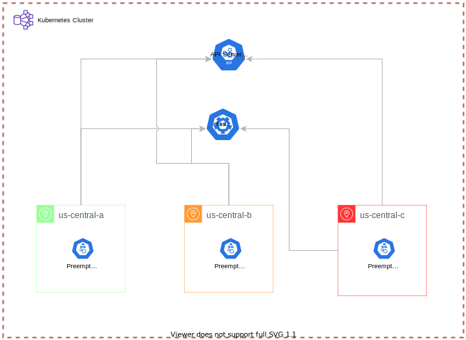

# GKE - Google Kubernetes Engine

Terraform project for provision Kubernetes Cluster for Google Cloud Platform. 

## Topology for default values


## Google Cloud Authentication (account.json)
The terraform module depends from authentication for gcloud, follow the instructions on this link: https://cloud.google.com/iam/docs/creating-managing-service-account-keys. You must create the service account and download with name `account.json`. After this you can run terraform commands for provision the resources.

## Terraform Commands

For run this project, you'll need run same commands for provision the infra on your account.


1 - Initialize terraform module
```
terraform init
```

2 - Verify the changes
```
terraform plan
```

3 - Create or Update resources
```
terraform apply
```

4 - Show information about cluster created
```
terraform output
```

## LICENCE
The license for this project is MIT.